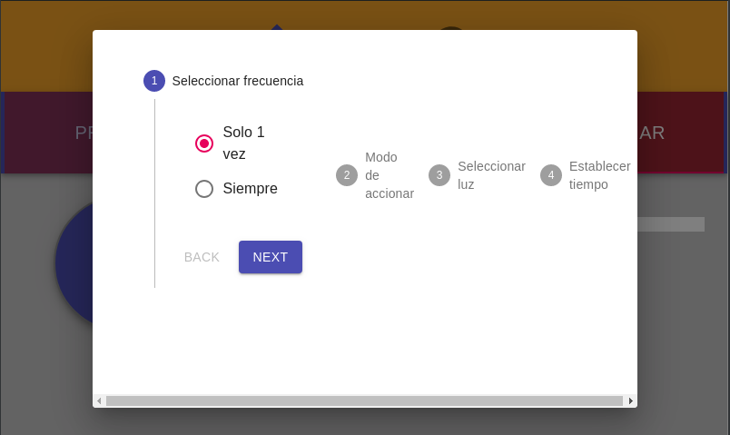

Comienzo de frontend en React para control de habitacion

Todas las solicitudes son enviadas a localhost:4000
Repo de proyecto backend:
https://github.com/nmedela/Node-Habitacion/tree/creacionDemonio

El proyecto está configurado para trabajar en una pantalla tactil de 5pulgadas de 800x480px en una RPi

Idea:
Tener 2 opciones: Control de luces y sonido.
En la seccion de sonido tenemos disponible el manejo del amplificador.
Apagao/encendido. Manejo de Volumen Mute Bass Treble Balance izquierda derecha.
Luces:
Principal-> encendido y apagado de luz principal
Escenas-> Seleccion de luz para dimerizar y seteo de escenas predefinidas
Programacion-> vista de programas creados. Posibilidad de setear un cronograma de escenas para las luces a X horarios.

Sonido:

Luces:
    Principal:

    Escenas:

    Porgramar:

    Pasos:

